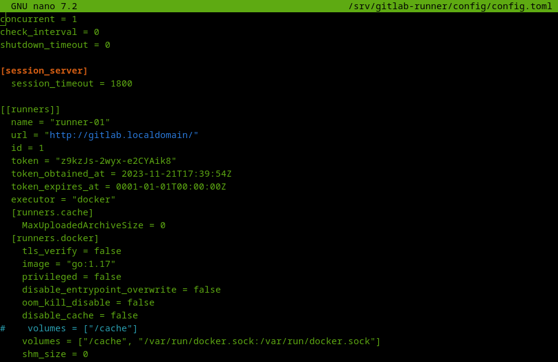

# Домашнее задание к занятию "`Gitlab`" - `Жаринов Павел`

# Задание 1

## Что нужно сделать:

1. Разверните GitLab локально, используя Vagrantfile и инструкцию, описанные в этом репозитории.
2. Создайте новый проект и пустой репозиторий в нём.
3. Зарегистрируйте gitlab-runner для этого проекта и запустите его в режиме Docker. Раннер можно регистрировать и запускать на той же виртуальной машине, на которой запущен GitLab.

### В качестве ответа в репозиторий шаблона с решением добавьте скриншоты с настройками раннера в проекте.

```
sudo apt install vagrant
sudo apt install virtualbox
wget https://app.vagrantup.com/ubuntu/boxes/noble64/versions/20231031.0.0/providers/virtualbox/unknown/vagrant.box

vagrant init ubuntu/noble64
vagrant box add ubuntu/noble64 bionic-server-cloudimg-amd64-vagrant.box
vagrant up
vagrant ssh -- sudo cat /etc/gitlab/initial_root_password
#vagrant halt
#vagrant destroy

   docker run -ti --rm --name gitlab-runner \
     --network host \
     -v /srv/gitlab-runner/config:/etc/gitlab-runner \
     -v /var/run/docker.sock:/var/run/docker.sock \
     gitlab/gitlab-runner:latest register

http://gitlab.localdomain/
token: GR134......x
docker
go:1.17

sudo nano /srv/gitlab-runner/config/config.toml

    volumes = ["/cache", "/var/run/docker.sock:/var/run/docker.sock"]

   docker run -d --name gitlab-runner --restart always \
     --network host \
     -v /srv/gitlab-runner/config:/etc/gitlab-runner \
     -v /var/run/docker.sock:/var/run/docker.sock \
     gitlab/gitlab-runner:latest
```




---

# Задание 2

## Что нужно сделать:

1. Запушьте репозиторий на GitLab, изменив origin. Это изучалось на занятии по Git.
2. Создайте .gitlab-ci.yml, описав в нём все необходимые, на ваш взгляд, этапы.
3. В качестве ответа в шаблон с решением добавьте:
   * файл gitlab-ci.yml для своего проекта или вставьте код в соответствующее поле в шаблоне;
   * скриншоты с успешно собранными сборками.

```
git clone https://github.com/netology-code/sdvps-materials.git
git remote -v
git remote add mygitlab http://gitlab.localdomain/netology/my_project.git
git remote -v
git push mygitlab

   docker run -ti --rm --name gitlab-runner \
     --network host \
     -v /srv/gitlab-runner/config:/etc/gitlab-runner \
     -v /var/run/docker.sock:/var/run/docker.sock \
     gitlab/gitlab-runner:latest register

http://gitlab.localdomain/
GR134.............x
docker
go:1.17

sudo nano /srv/gitlab-runner/config/config.toml
    volumes = ["/cache", "/var/run/docker.sock:/var/run/docker.sock"]
    extra_hosts = ["gitlab.localdomain:192.168.56.10"]

   docker run -d --name gitlab-runner --restart always \
     --network host \
     -v /srv/gitlab-runner/config:/etc/gitlab-runner \
     -v /var/run/docker.sock:/var/run/docker.sock \
     gitlab/gitlab-runner:latest

watch -n 1 docker ps

nano .gitlab-ci.yml
   
stages:
  - test
  - build

test:
  stage: test
  image: golang:1.17
  script: 
   - go test .

build:
  stage: build
  image: docker:latest
  script:
   - docker build .
      
git status
git add .
git commit -am "add gitlab-ci.yml"
git push mygitlab
```

